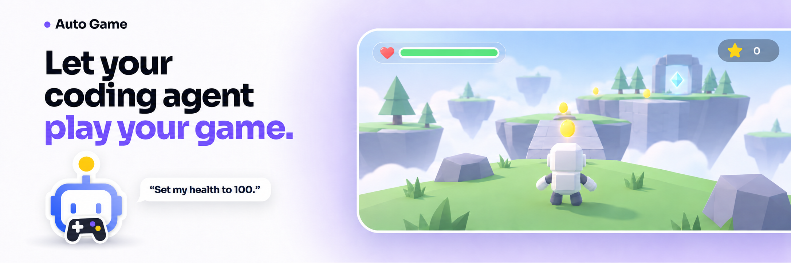
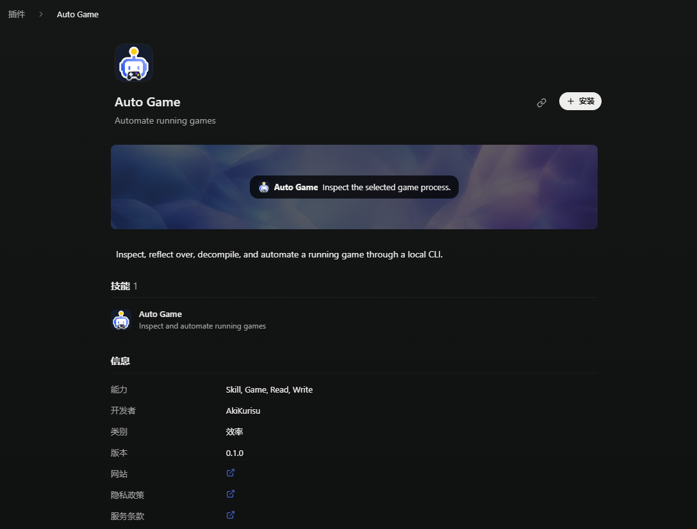
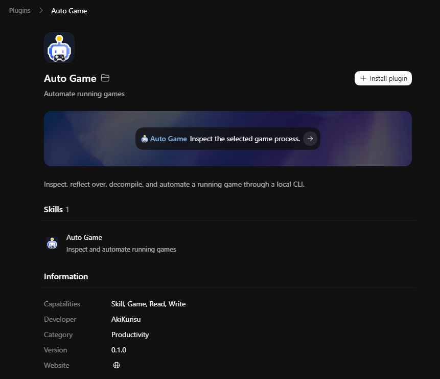

[English](./README.md) · [架构](./docs/architecture.md) · [License](./LICENSE)

让 coding agent 帮你玩游戏！

## 它能做什么

Auto Game 提供了一键式 CLI，方便 coding agent 自动化操作游戏。

> 目前仅支持 Unity Mono 后端的游戏，IL2CPP 和其他游戏引擎暂不支持。

## 安装

把本仓库添加为插件市场，安装 **Auto Game**：

- **DotCraft** — 打开 **Plugins**，在 **Create** 旁边的菜单里选 **Add marketplace**，填入 `AkiKurisu/auto-game`。

  

- **Codex** — 运行 `codex plugin marketplace add AkiKurisu/auto-game`。

  

剩下的交给 Agent：

> 帮我配置一下 Auto Game。

## 使用

启动游戏，然后直接开口：

> 把我的血量改成 100。

## License

[Apache License 2.0](./LICENSE)
