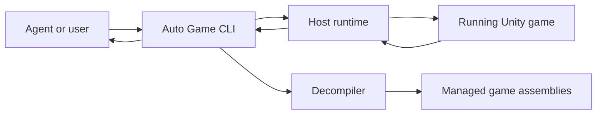

# Architecture

Auto Game lets an agent inspect and automate a running Unity game through a local command-line interface.

## Components

- **CLI** provides stable commands and JSON input and output.
- **Host runtime** discovers supported games, manages connections and executions, and reports results.
- **Game runtime** performs requested work inside the selected game.
- **Decompiler** provides source views of managed game assemblies for inspection and automation planning.
